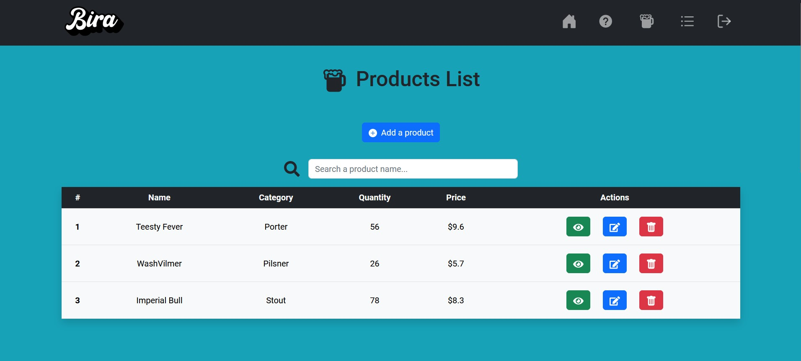

# Bira 🍻

Bira est une entreprise américaine fictive commercialisant des bières, possèdant une application permettant à des salariés de gérer les bières en stock.

## Lien

La partie back-end de l'application est accessible à partir du lien suivant:
- [Back-end](https://github.com/kitaah/BiraAPI)

## Fonctionnalités

- **Accès visiteur:** page de connexion et de création de compte.
- **Accès utilisateur:** connexion, création de compte, consultation et gestion des bières et des catégories de bières.

## Langages

- **Front-end:** HTML, CSS, JavaScript, SASS (avec utilisation de la librairie JavaScript React et du framework CSS Bootstrap).
- **Back-end:** #C (avec utilisation du framework ASP.NET Core pour la mise en place d'une API REST).

## Outils

- **IDE:** Visual Studio
- **Base de données:** PostgreSQL
- **Création de compte et connexion:** Firebase
- **Gestion de version**: Git

&nbsp;&nbsp;&nbsp;&nbsp;&nbsp;&nbsp;&nbsp;&nbsp;&nbsp;&nbsp;&nbsp;&nbsp;&nbsp;&nbsp;&nbsp;&nbsp;  &nbsp;&nbsp;

## Screenshot

 

